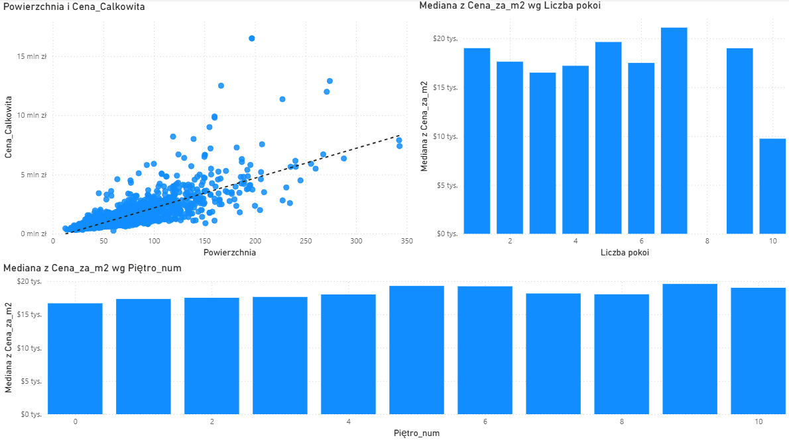
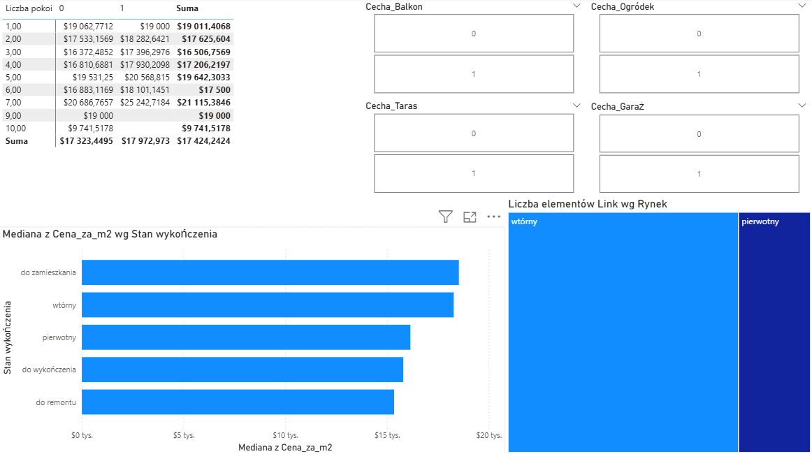
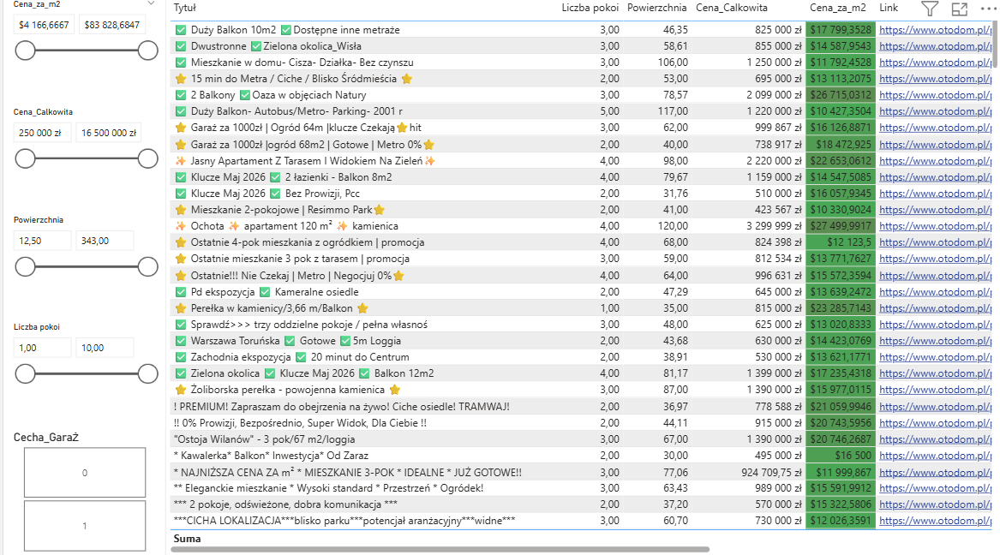

# 🏙️ Warsaw Real Estate Market Analysis (End-to-End Data Pipeline)

## 📌 About the Project
This project is a comprehensive ETL (Extract, Transform, Load) data pipeline analyzing the real estate market in Warsaw. The goal was to build a tool for automated extraction, cleaning, and visualization of market data to identify key trends, hidden patterns, and potential investment opportunities (outliers).

The dataset consists of over 4,400 unique listings from the Otodom platform, processed and presented in a 4-page interactive Power BI dashboard.

*> Note: Since the data comes from the Polish market, specific feature flags and dataset values have been kept in Polish to maintain data integrity.*

## ⚙️ Architecture & Technologies
The project consists of three main phases:

### 1. Data Collection (Web Scraping) - `scraper.py`
A Python script utilizing **Selenium** and **BeautifulSoup4** for data extraction.
* **Bot Detection Evasion:** Configuration of User-Agent headers and Chrome Options flags.
* **Reliability (Smart Resume):** A checkpointing mechanism that saves progress to a CSV file every 100 listings. In case of an internet connection drop, the script automatically skips previously scraped URLs and resumes from the point of failure.
* **JSON-LD Parsing:** Extraction of hidden metadata (premium features, building details) embedded within the page's source code, bypassing standard HTML structure.

### 2. Data Cleaning & Engineering - `cleaner.py`
Processing raw input data using the **Pandas** library to prepare it for business analytics.
* **Data Type Conversion & Regex:** String cleansing (stripping "zł", "m²", thousands separators) and standardizing floating-point formats.
* **Floor Level Logic:** Converting textual values (e.g., "ground floor", "basement") into a numerical format (0, -1).
* **One-Hot Encoding & Feature Extraction:** Transforming chaotic, unstructured lists (a "bag of words" with real estate agents' typos) into functional binary flags for key features (e.g., `Cecha_Garaż`, `Cecha_Balkon`, `Cecha_Klimatyzacja`).

### 3. Data Visualization & Analytics - Power BI
An interactive analytics dashboard divided into 4 business-focused sections.
* Using **DAX** to create calculated columns and measures (e.g., square footage categorization, safe division by zero handling).
* Advanced text data modeling (filtering out garbage values directly within Power Query).

---

## 📈 Key Business Insights

The data analysis revealed several core behavioral patterns in the Warsaw real estate market:

1. **The Mean vs. Median Gap:** The average property price was approximately 1.17M PLN, while the median stood at 890k PLN. This confirms a strongly right-skewed price distribution, where a handful of luxury premium apartments drastically inflate the mean. Consequently, the core KPIs in the dashboard were deliberately based on the median.
2. **The "U" Curve for Price per Square Meter:** The standard "staircase" model (the larger the apartment, the cheaper the price per sqm) only applies up to 4-5 rooms (most expensive studios at ~19k PLN/m² dropping to ~16.5k PLN/m² for 3 rooms). For 7+ room properties, the price surges sharply (median >21k PLN/m²), indicating a transition into the luxury penthouse and premium segment.
3. **Outlier Detection (Investor's Radar):** Scatter plots mapping area vs. total price enabled quick identification of price anomalies (potential fixer-uppers or seller pricing errors).

---

## 🖼️ Dashboard Preview (Power BI)

### Page 1: Executive Summary
A high-level market overview – key performance indicators (KPIs), supply structure (room count, primary vs. secondary market), and base filters.

### Page 2: Price and Area Trends
Analysis of the "U" curve (price per m² by room count) and a scatter plot (Investor's Radar) for spotting market opportunities.

### Page 3: Premium Features Analysis
Pricing matrices demonstrating how specific attributes (garage, balcony, air conditioning, finishing standard) impact the final valuation per square meter.

### Page 4: Listing Search Engine
A practical filtering tool in the form of a detailed table, allowing users to narrow down 4,400 results to a few specific listings, complete with direct hyperlinks to the offers.

---

## 🚀 How to Run the Project
1. Clone the repository.
2. Install the required packages: `pip install pandas selenium bs4 webdriver-manager`.
3. Run `scraper.py` to start live data extraction (Google Chrome is required).
4. After the scraping is complete, run `cleaner.py` to generate the `nieruchomosci_czyste.csv` file.
5. Open the `.pbix` file in Power BI Desktop and explore the interactive dashboard.